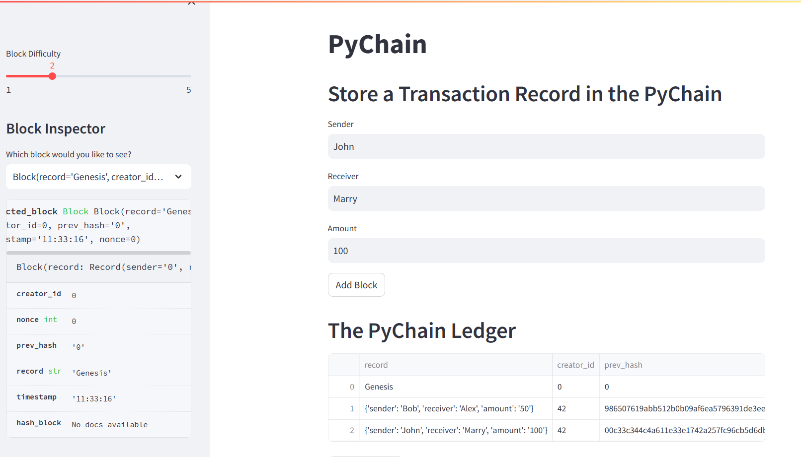
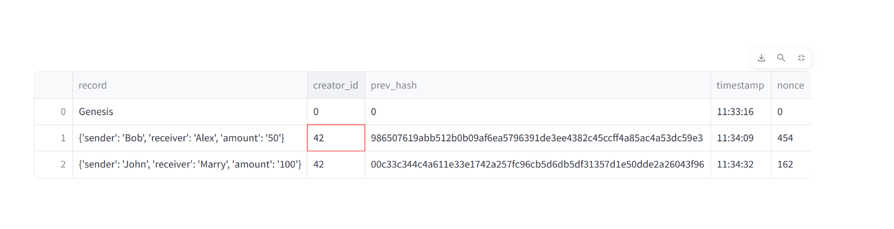

# PyChain Ledger

This GitHub repo implements a blockchain-based ledger system, completed with a user-friendly web interface. 

#### The steps for this Challenge are divided into the following sections:

1. Create a Record Data Class

2. Modify the Existing Block Data Class to Store Record Data

3. Add Relevant User Inputs to the Streamlit Interface

4. Test the PyChain Ledger by Storing Records

#### Dependencies
  * Pandas
  * streamlit
  * hashlib
  
#### PyChain Streamlit Web Interface Validation:

|                                 | 

